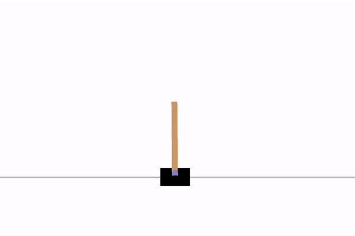
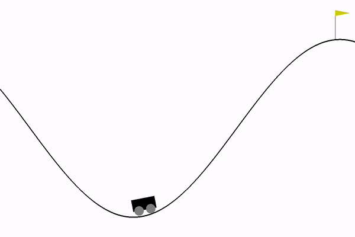

# DQN-DDQN

Deep Q-Network is a powerful yet intuitive Reinforcement Learning algorithm. Here we implement both DQN and its adaptation, Dueling Deep Q-Neworks to solve two problems in OpenAI Gym: Cartpole-v0 and MountainCar-v0.

First, let us investigate the following questions:

## What is and why Q learning?

Q-learning is an off policy, tabular reinforcement learning algorithm. It is off-policy RL because the q-learning function learns from actions that are not the most updated policy. Essentially, q-learning seeks to learn a policy that maximizes the total reward.

Q learning is useful when we seeks to find the best action to take given the current state. In Q-learning related algorithms, an agent tries to learn the optimal policy from its history of interaction with the environment. It's an intuitive an elegant solutions to many RL problems.

## What is DQN and DDQN?

Instead of using the tabular reprenestation of the of the state-action, in Deep Q-Learning (dQN) we use a neural network to approximate the Q function. This is because using matrix to keep track of relative importance in simple Q learning is limited both in reprentational power and in the level of dimension the tabular table can scale. Thus, DQN utilzes deep neural network to approximate the q values, long as the relative importance is preserved.

DDQN, or Dueling Deep Q Networks is an adaptation of DQN reinforcement learning algorithms that tries to create a Q value via two function estimators: one that estimates the advantage function, and another that estimates the value function. DDQN is introduced to solve Q value overestimation issue commonly appears in DQN (since DQN uses a single target network to both select and evaluate every action).

## Demo

### Before training

### After traning

